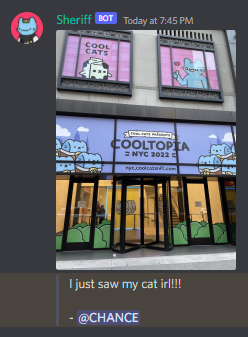

# Discord Executable Attachment Sheriff Bot 

At current time, there is a massive group of Discord communites that are constant stress and fear that they may be putting their community members at risk by allowing individuals to upload images and files.

The struggle explained by the Cool Cats team:

> I understand its a inconvenience. However please understand the risk is very high at the moment if we do enable sharing photos directly. 
> 
> There was a zero day vulnerability that was found for Microsoft office that allows an attacker to run malicious code even if you don't click a document, and this can compromise your discord account. Holders, Mods and team members could be compromised, which can lead to bigger wide-spread compromises as you can imagine. 
>
> While we are looking for a solution, it's a huge risk for everyone because not only could this be used to compromise discord accounts, it could also be used to steal nfts from people. So imagine it happening while everyone is in NYC. 
> 
> Trust that we don't like that we cannot share images from NYC directly here either, but we do need to listen to our security experts in this matter and be as careful as possible during a time not only our community but our team will be in NYC.
> 
> -- Queeny (Community Manager of the Coolest Cats in web3!)

On top of this, Discord does not have a native way to allow images while disallowing other file formats. Digital security is difficult and the best practice when a solution is not known is a general sweep of being overly secure. For many, this has resulted in disabling the allowance of sending images in a discord channel. 

With NFT NYC right around the corner it will do a lot of projects good to re-enable the ability to send images. There are of course ways to clean this up as well as this could be hosted as a bot. To use this, you will need to setup and host the bot yourself.

**RUNNING:**

> * create bot in Discord Developer Portal
> * invite bot to server
> * invite the bot with the permissions:
> 
>   * send messages
>   * manage messages
>   * attach files
> 
> * setup .env with BOT_TOKEN
> * pip install -r requirements.txt
> * python bot.py

**DEfAULT MODE:**

For this, we are preventing the sharing of any document that is not a simple image. With this, this means that the usage of raw gifs is not supported. A gif can still be used however by including the link like `https://media.giphy.com/media/qgL9pKdSqeKYNkPMGC/giphy.gif`

**PERMITTED_ROLES:**

Allows you to define which roles can have attachments on the messages that we will clean. If not roles are provided, all roles can send and are scrutinized. This could be utilized by enabling the sharing of attachments for more heavily integrated holders.

Such as those servers that have levelling systems, or for Cooltopia which has "Discord Heroes"

**CHANNELS:**

Allows you to define which channels have attachment sharing enabled. This could be used for something like a 'Holders Only' chat.

**EXTRA SECURE MODE:** 

Malicious 'code' in images come from the usage of metadata.

⚪ EXIF data - what camera was used, what lens, what exposure, GPS info and so on

⚪ ICC Colour Profiles for accurate colour reproduction

⚪ IPTC information - press and telecoms info, copyright, subject-matter tagging and so on

⚪ Geo-referencing and/or photogrammetry information - see GeoTIFF

⚪ comments - which can contain arbitrary information (and malware)

The usage of this script re-enables the secure sharing of images by immediately removing the inclusion of any 'attachment' containing messages unless those attachments fall within the categories we've strictly defined.

That is, png, jpg, jpeg, and technically, heic.

Discord does not have a data buffer for the actual image contents, thus we have to enable the functionality to download the image, strip everything but the image data and then send the content in replacement.

With this, the bot will send the images after having cleaned and deleting the user-provided image. Because the message from the original sender is being deleted, it is advised to set `CREDIT_AUTHOR` to `True`.

**CREDITING AUTHOR:**

With author crediting enabled the bot will follow up the attachment message with the message caption provided when first uploading the image along with accreditation.

**MAINTENANCE:**

If this turns out to be needed in the coming weeks I will update this with a few improvements. I understand if you are not familiar with running and hosting bots yourself that can be a big hurdle to jump. If enough people end up needing this and having trouble, I will a central system so that all you have to do is invite it. Let me know, this isn't something I will do unprompted.